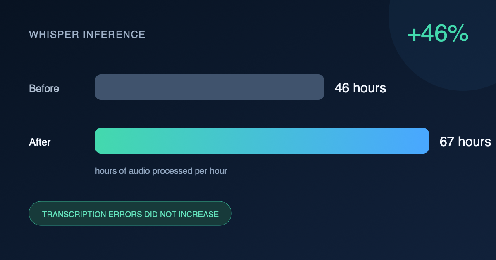

# Whisper large-v3-turbo inference optimization on RTX 3090

An evidence-backed optimization of the official `faster-whisper` serving path on one NVIDIA RTX 3090. The benchmark freezes the model snapshot, LibriSpeech workload, decode semantics, evaluator, and promotion gates before comparing candidates.



## Result

On all 2,620 LibriSpeech `test-clean` utterances, the promoted configuration increases warm whole-system throughput from **46.0244× to 67.3148× real time (+46.2590%)** and reduces wall time by **31.6281%**. Peak GPU allocation falls **21.38%**, failures remain zero, and the finite-set quality oracle improves from 1,391 edits / 2.6186% WER to 1,368 edits / 2.5753% WER.

| Configuration | Throughput | Utterances/s | Peak GPU allocation | Edits / WER |
| --- | ---: | ---: | ---: | ---: |
| Immutable FP16 baseline | 46.0244× | 6.199 | 3.100 GB | 1,391 / 2.6186% |
| Promoted int8, 2 workers, concurrency 4 | **67.3148×** | **9.066** | **2.437 GB** | **1,368 / 2.5753%** |

This is a finite-workload result, not a universal quality claim. On the harder predeclared `test-other` set, throughput improves 42.67% but WER rises by 0.03961 percentage points. That result is kept as a transparent quality-budget frontier and does not pass the strict no-increase gate.

## What changed

- Switched to a supported quantized CTranslate2 compute path.
- Used two resident model workers with a bounded four-request concurrency window.
- Preserved beam size 5, English transcription, temperature 0, VAD off, full generator consumption, and the candidate-independent evaluator.
- Rejected slower, unsupported, or quality-changing alternatives instead of hiding them.

No custom CUDA kernel or model retraining is claimed.

## Reproduce

The setup script pins `faster-whisper==1.2.1`, `ctranslate2==4.8.1`, the exact model revision, and the official OpenSLR archive checksum. Model and dataset downloads happen directly on the GPU.

```bash
bash scripts/setup_remote.sh
bash scripts/run_wsp005_pairs.sh
bash scripts/run_wsp005_full_b.sh
bash scripts/run_wsp004_pairs_v2.sh
bash scripts/run_wsp004_guardrails.sh
```

The scripts derive the repository root automatically. Set `PROJECT=/your/path` or `PY=/your/python` only when overriding the defaults.

## Evidence map

- [`docs/PORTFOLIO-CASE.md`](docs/PORTFOLIO-CASE.md) — full result, economics proxy, tradeoffs, and reproduction map
- [`docs/ACTIVE-CONTRACT.md`](docs/ACTIVE-CONTRACT.md) — frozen experiment contract
- [`docs/TEST-OTHER-CONFIRMATION.md`](docs/TEST-OTHER-CONFIRMATION.md) — harder-set generalization and quality boundary
- [`docs/FAILURE-INDEX.md`](docs/FAILURE-INDEX.md) — preserved negative and unsupported candidates
- [`evidence/inference-traces.jsonl`](evidence/inference-traces.jsonl) — append-only experiment history
- [`results/summary.json`](results/summary.json) — compact machine-readable result
- [`benchmarks/run_benchmark.py`](benchmarks/run_benchmark.py) and [`benchmarks/evaluate.py`](benchmarks/evaluate.py) — candidate-independent runner and evaluator

## Scope

- GPU: NVIDIA RTX 3090 24 GB
- Model: pinned faster-whisper `large-v3-turbo` snapshot
- Primary dataset: official LibriSpeech `test-clean`, 19,452.48 audio seconds
- Primary metric: audio seconds divided by measured wall seconds
- Timing: warm resident-model inference; startup reported separately
- Quality gate: no increase in corpus WER or total edit distance, zero failures

See the portfolio case for exact hashes, runtime versions, AB/BA evidence, latency interpretation, and all claim boundaries.

## Repository contents

```text
benchmarks/       frozen workload builder, runner, and quality evaluator
candidates/       the two promoted implementations and promotion receipts
docs/             contract, full case study, harder-set result, and failures
evidence/         compact append-only experiment trace
results/          machine-readable headline result
scripts/          setup and paired reproduction commands
```

Large model weights, LibriSpeech audio, raw per-utterance outputs, provider logs,
device identifiers, and process receipts are intentionally excluded. The setup
script fetches public model and dataset artifacts directly in the reproduction
environment.
